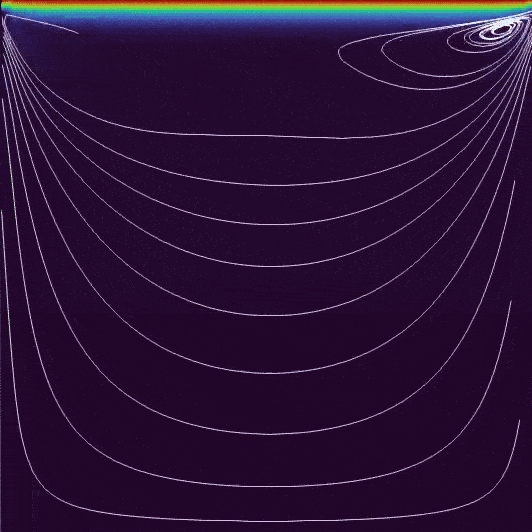
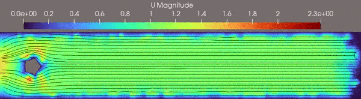

# Computational Fluid Dynamics Repository
<p align='center'>
    
</p>

This repository is specifically designed for individuals who are new to the field of Computational Fluid Dynamics (CFD) and want to develop their first CFD solver. Its primary objective is to provide an introduction to the basic principles of CFD through a series of Jupyter notebooks and detailed descriptions.

The Jupyter notebooks contain step-by-step instructions on how to implement various CFD techniques, such as Chorin's Projection Method for solving the incompressible Navier-Stokes equations, as well as the Heat-Transfer equation to account for thermal effects. These notebooks are accompanied by sample codes that users can modify to suit their specific needs.

# Quick introduction
<p align='center'>
    
</p>

## Simulation parameters
During this step, we define the simulation parameters, including:
- $\Delta t$ - timestep length ($\mathrm{s}$), which should be selected carefully as it significantly affects the stability of the simulation. To determine the appropriate value, the CFL condition must be taken into account.
- $N$ - the number of timesteps.

Some physical properties of the fluid are:
- Density ($\rho$), which is the amount of mass per unit volume of the substance, measured in $\mathrm{kg/m^3}$.
- Dynamic viscosity ($\mu$), measured in $\mathrm{Pa\cdot s}$, which is a measure of the fluid's resistance to flow.
- Thermal conductivity ($k$), measured in $\mathrm{W/(m\cdot K)}$, which is a measure of the material's ability to conduct heat.
- Specific heat capacity ($C_p$), measured in $\mathrm{J/(kg\cdot K)}$, which is the amount of heat required to raise the temperature of one unit of mass of the fluid by one degree Kelvin.


## Domain
In numerical solutions, a mesh is a discretization of a continuous domain into smaller, finite-sized elements, which are used to numerically approximate the solution of partial differential equations (PDEs). You can think of a mesh as a collection of nodes and edges that define the shape of the computational domain, where each element in the mesh represents a small portion of the domain.

In FEniCS, there are two ways to define a mesh:
- The first way is to use the `mshr` module to create a mesh. This involves defining the domain using Constructive Solid Geometry's three basic operations (subtract, intersection, and union), and then generating a mesh with a specified density using the `mshr.generate_mesh(your_domain,mesh_density)` function.
- The second way is to read a pre-existing mesh from an `.xml` file using the FEniCS `Mesh` function. For example, you can define a mesh with `mesh = fe.Mesh('path.xml')`. This is useful when you have a mesh that was created by another software or method and want to import it into FEniCS for further computations.

## Understanding Boundary and Initial Conditions
### Boundary Conditions (BC)
The purpose of boundary conditions is to determine unknown function values on domain's boundary. Most common boundary conditions are:
- Dirichlet boundary conditions specify the value of the function at the boundary. For example, $T(0.0,y) = 200.0$ sets the temperature at the left boundary of the domain to a constant value of 200.0.
- Neumann boundary conditions specify the normal derivative of the function at the boundary. For example, $\frac{\partial T}{\partial x}(L,y) = 0.0$ fixes the heat flux at the right boundary of the domain to zero.

In FEniCS, we can create a list of boundary conditions. Note that for the first element, we pass a C++ expression string as the third argument, but for the second, we pass a Python function. FEniCS supports multiple ways to define boundary conditions.

```Python
def left_boundary(x, on_boundary): return on_boundary and near(x[0], 0.0)

velocity_boundary_conditions = [
    fe.DirichletBC(V, Constant((0.0, 0.0)), 'on_boundary'),
    fe.DirichletBC(V, Expression(('4.0*1.5*x[1]*(0.41 - x[1]) / pow(0.41, 2)', '0')), left_boundary)]
```

Boundary conditions are frequently applied in the following manner:
```Python
[bc.apply(A, b) for bc in bcs]
```

### Initial Conditions (IC)
The initial conditions describe the field values at the start of the simulation, i.e., at $t=0$. To set the initial state for a field in FEniCS, we can use the following syntax:

```Python
# Set the initial circular conditions with a center at (0.5, 0.5) and a magnitude of 60
t_prev.interpolate(
    Expression(
        '60 * (0.5*(1 - tanh(8*(sqrt(pow(x[0]-0.5, 2) + pow(x[1]-0.5, 2)) - 0.1))))',degree=1)
)
```
Here, `t_prev` is assigned an initial condition using `Expression()` with an expression evaluated for each point in the domain. The example above defines circular initial conditions with a center at $(0.5,0.5)$ and a magnitude of 60.

## Weak forms
In order to solve Partial Differential Equations (PDEs) using FEniCS, it is necessary to represent them in their weak form. For instance, the first step of the Chorin's Projection Method described in the [Solution Strategy](#solution-strategy) section can be represented in its weak form as follows:

```math
\int\limits_\Omega \frac{\mathbf{u}^\star - \mathbf{u}^n}{\Delta t} \cdot v \,dx = 
- \int\limits_\Omega \nabla\mathbf{u}^n \cdot v \,dx 
- \int\limits_\Omega \nu\,\nabla\mathbf{u}\cdot\nabla\,v\,dx
```

The full derivation of equation weak forms can be found in [the file](/docs/WeakFormsDerivation.md). By expressing PDEs in their weak form, FEniCS can utilize finite element methods to discretize the problem and obtain a numerical solution. 

In code:
```Python
# Weak form of the momentum equation
momentum_residuum = (
    (1.0 / dt) * fe.inner(u - u_prev, v) * fe.dx
    + fe.inner(fe.grad(u_prev) * u_prev, v) * fe.dx
    + nu * fe.inner(fe.grad(u), fe.grad(v)) * fe.dx)
```

# Solution strategy
The aim of this project is to solve the incompressible Navier-Stokes equations using Chorin's Projection Method (steps 1-3). The solution strategy can be summarized in the following steps:

1. Solve the momentum equation without the pressure term to obtain the tentitive velocity denoted as $\mathbf{u}^\star$. This step can be represented by the following equation:
```math
\frac{\mathbf{u}^\star - \mathbf{u}^n}{\Delta t} =
 - (\mathbf{u}^{n}\cdot\nabla)\mathbf{u}^{n} 
 + \nu\,\mathbf{u}\nabla^{2}\mathbf{u}^{n}
```
Velocity boundary conditions are thenapplied to $\mathbf{u}^{\star}$

2. Solve the pressure Poisson equation to obtain the pressure field and correct the tentitive velocity to make the fluid incompressible. The pressure Poisson equation can be represented as:
$$\nabla \mathbf{u}^{\star} = \frac{\Delta t}{\rho} \nabla^{2}\,p$$
Apply pressure boundary conditions.

3. Correct the tentitive velocity by updating it with the pressure field obtained in the previous step. This step can be represented by the following equation:
```math
\mathbf{u}^{n+1}=\mathbf{u}^{\star} - \frac{\Delta t}{\rho}\nabla\,p^{n+1}
```
Velocity boundary conditions are then applied.

4. Optional: Solve Heat-Tranfer equation for $T^{n+1}$ using velocity $\mathbf{u}^{n+1}$
```math
\frac{T^{n+1}-T^{n}}{\Delta t} 
= \alpha \nabla^{2}T^{n} - \frac{1}{\rho C_{p}} (\mathbf{u}\cdot\nabla)T^{n}
```

5. Advance in time

# Useful links:
- [Chorin's Projection Method](https://en.wikipedia.org/wiki/Projection_method_(fluid_dynamics))
- [FEniCS Incompressible Navier-Stokes equations demo](https://fenicsproject.org/olddocs/dolfin/1.4.0/python/demo/documented/navier-stokes/python/documentation.html)
<!-- - [CFL condition](https://en.wikipedia.org/wiki/Courant%E2%80%93Friedrichs%E2%80%93Lewy_condition) -->
<!-- - [ParaView - Open-source, multi-platform data analysis and visualization application](https://www.paraview.org/) -->
<!-- - [12 steps to Navier-Stokes by Lorena Barba](https://lorenabarba.com/blog/cfd-python-12-steps-to-navier-stokes/) (Simple incompressible Navier-Stokes Finite Difirence Mehod solver) -->